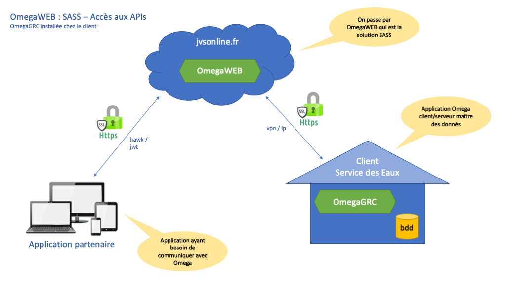
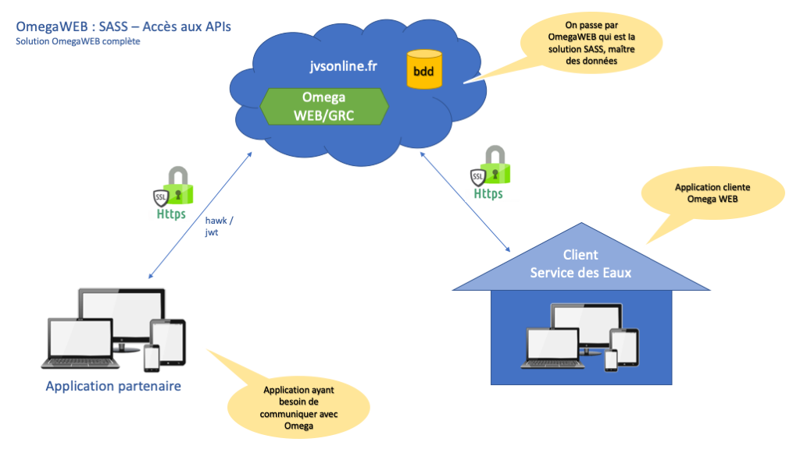

Documentation des APIs Omega
---

# Présentation

Omega est une application dédiée aux structures de distribution de l’eau et d’assainissement. Afin de communiquer avec ses partenaires des APIs ont été implémentées. Cette documentation a pour but d'expliquer le fonctionnement de ces APIs, mais, dans tous les cas, leur usage devra être enregistré et validé par nos équipe techniques (prendre contact avec votre correspondant habituel pour cela). [JVS-Mairistem](https://www.jvs-mairistem.fr/approche/omega).

**Important**

Les principaux éléments métier de l'application Omega sont interrogeable via service web afin de retourner un ou plusieurs éléments. Il existe la possibilité d'utiliser un système de filtres et également de retourner ou non les éléments périphériques de ces objets métier afin de réduire les appels aux services web.

Il faut noter que toute demande de modification passe par une "demande" et ne sera pas forcément effectuée de manière automatique mais peut-être soumise à validation par un opérateur. Chaque demande se vera attribuer un numéro et il sera possible de suivre son évolution.

Il est fortement déconseillé de stocker des informations liées à un objet, excepté son identifiant qui sera stable dans le temps. Ne pas stocker par exemple les informations d'un point de consommation, mais son id, car le numéro, le compteur posé, ... peuvent évoluer dans le temps. Il faut donc simplement interroger le service web correspondant avec l'id de l'objet pour disposer des informations.

# Techniquement

* Format des échanges : Json-Api, spécifications décrites [ici](https://jsonapi.org/format/1.0/)
* Echanges soumis à un contrat préalable d'utilisation avec JVS-Mairistem.
* [Spécificités Json-Api](./jsonapi.md) liées à Omega.

**Vous trouverez certains exemples d'utilisation sous divers langages sur [github](https://github.com/jvs-groupe)**

# Authentification

## Partenaires

Pour les partenaires une authentification basée sur les spécifications [Hawk](https://github.com/hueniverse/hawk) a été mise en place. Nous fournirons par client un accès via clef ainsi qu'un identifiant et une clef de sécurisation pour le protocole Hawk. Ces clefs et identifiants ne devront pas être accessible par les utilisateurs finaux et devront rester secrets.

# Limitations

Les APIs ne sont pour l'instant accessible qu'en lecture. Pour modifier des données un système de "demandes" a été mis en place afin que le service des eaux soit le responsable du contrôle et de la validation des demandes de changements de données. Il sera bien entendu possible de suive l'évolution de ces demandes. Le service des eaux se réserve le droit de refuser ou rejeter une demande de modification non conforme.

# Schéma général de circulation

Afin de garder une cohérence dans le temps pour les APIs et utiliser des technologies récentes et sécurisées tous les appels passeront forcément par OmegaWEB, application en SASS.

* Description détaillée de l'[API](./api.md)