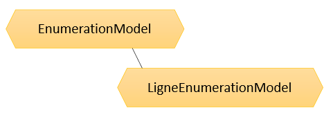

Documentation des APIs Omega
---

# Présentation

Omega est une application de gestion et facturation de l'eau. Afin de communiquer avec d'éventuels partenaires des APIs ont été implémentées. La description de ces APIs est libre, par contre pour en profiter, il faut prendre contact avec la société [JVS-Mairistem](https://www.jvs-mairistem.fr/approche/omega).

# Techniquement

* Format des échanges : Json-Api, spécifications décrites [ici](https://jsonapi.org/format/1.0/)
* Echanges soumis à un contrat préalable d'utilisation avec JVS-Mairistem.
* [Spécificités Json-Api](./jsonapi.md) liées à Omega.

** Vous trouverez certains exemples d'utilisation sous divers langages sur [github](https://github.com/jvs-groupe) **

# Authentification

Il existe plusieurs techniques d'authentification à appliquer en fonction des besoins. En effet certaines sont réservées à une utilisation pour des partenaires qui pourront consulter la base de données sur une population définie et d'autres à destination des abonnés qui pourront consulter leurs données personnelles sous convert de la création d'un compte.

## Partenaires

Pour les partenaires une authentification basée sur les spécifications [Hawk](https://github.com/hueniverse/hawk) a été mise en place. Nous fournirons par client un accès via clef ainsi qu'un identifiant et une clef de sécurisation pour le protocole Hawk. Ces clefs et identifiants ne devront pas être accessible par les utilisateurs finaux.

## Accès abonné

Pour un accès abonné, l'API va permettre de créer et administrer un compte qui délivrera un jeton [JWT](https://jwt.io/introduction/) suite à une phase de login réussie pour que l'abonné puisse consultée ses données personnelles.

# Limitations

Les APIs ne sont pour l'instant accessible qu'en lecture. Pour modifier des données un système de "demandes" a été mis en place afin que le service des eaux soit le responsable du contrôle et de la validation des demandes de changements de données. Il sera bien entendu possible de suive l'évolution de ces demandes. Le service des eaux se réserve le droit de refuser ou rejeter une demande de modification non conforme.

# Schéma général de circulation

Afin de garder une cohérence dans le temps pour les APIs et d'utiliser des technologies récentes et sécurisées tous les appels passeront forcément par OmegaWEB, application en SASS.

# APIs

Les APIs ont pour but principal de mettre à disposition les données liées aux points de consommation et contrats; soit restreint à un seul abonné (cas d'un JWT identifiant un abonné), soit restreint à une population en accord avec le partenaire.

## Fonctionnement

**Le fonctinnement décrit ci-dessous est lié au format Json-Api**

Chaque objet "métier" aura un équivalent en modèle dans l'API. Par défaut sans rien préciser l'API va retourner les données jugées principales de cet objet. Par exemple pour une liste de contrats on aura les données du contrat, son adresse et l'occupant. Pour un seul contrat on aura en plus les relevés et les factures. Ceci étant bien entendu paramétrable à la demande pour optimiser au mieux les flux échangé avec OmegaWEB, ça ne sert à rien de retourner des données volumineuses non exploitées.

Pour rappel le lien de la [partie technique](./jsonapi.md) de l'API pour réaliser ces filtres, inclusions, ...

## Le Point de consommation

Pour faire simple, un point de consommation peut être assimilé à un compteur. Voici le modèle général de l'API :

