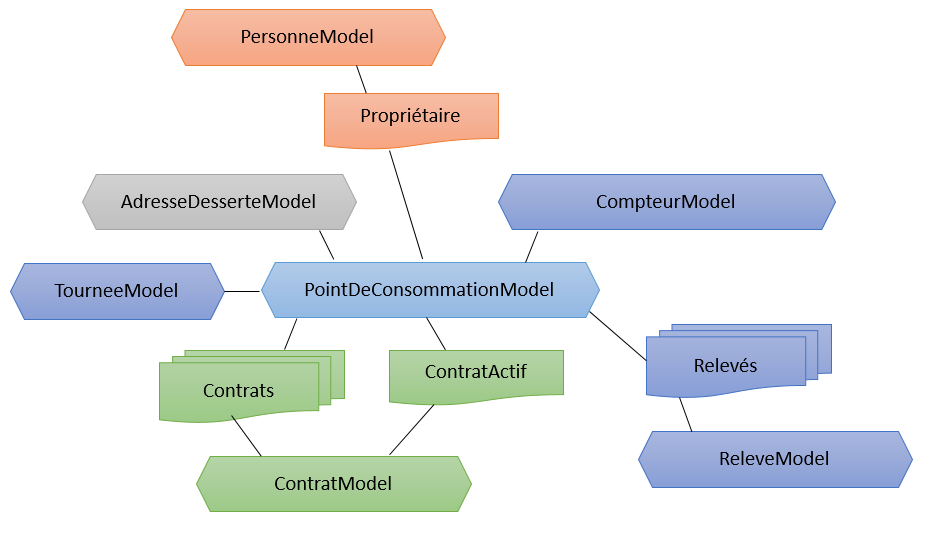
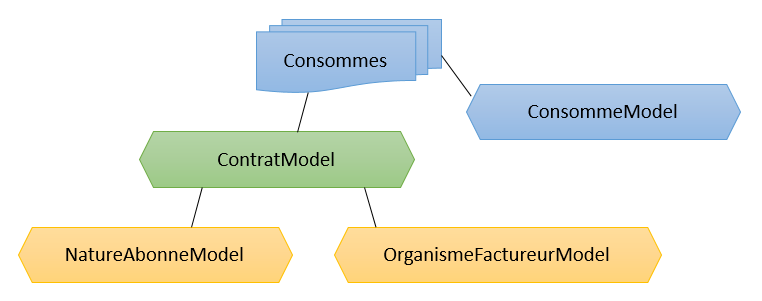

# APIs

Les APIs ont pour but principal de mettre à disposition les données liées aux points de consommation et contrats; restreint à une population en accord avec le partenaire.

## Fonctionnement

**Le fonctinnement décrit ci-dessous est lié au format Json-Api**

Chaque objet "métier" aura un équivalent en modèle dans l'API. Par défaut sans rien préciser l'API va retourner les données jugées principales de cet objet. Par exemple pour une liste de contrats on aura les données du contrat, son adresse et l'occupant. Pour un seul contrat on aura en plus les relevés et les factures. Ceci étant bien entendu paramétrable à la demande pour optimiser au mieux les flux échangés avec OmegaWEB, ça ne sert à rien de retourner des données volumineuses non exploitées.

Pour rappel le lien de la [partie technique](./jsonapi.md) de l'API pour réaliser ces filtres, inclusions, ...

## Tester l'accès, maîtriser les "Headers"

A ce niveau aucune en-tête ApiId n'est nécessaire, mais il est conseillé de l'ajouter. En cas de code retour 415, vérifiez que vous avez bien renseigné l'en-tête Accept, donc au minimum :

```
  ApiId: key@name
  Accept: application/vnd.api+json
```

### Test simple

Le service web ci-dessous doit renvoyer une réponse 204 sans contenu. Si l'accès est soumis à restriction IP, il faudra nous communiquer les IPs ou masques à ajouter dans notre whitelist pour cet accès.

* Endpoint : /api/v1/partner/test

### Test 404 avec une réponse au format Json-Api

* Endpoint : /api/v1/partner/test-404
* Résultat attendu :

```
{
    "errors": [
        {
            "links": {
                "about": "http://jsonapi.org/format"
            },
            "code": "404",
            "title": "Not Found!"
        }
    ]
}
```

Pour le résultat on peut donc soit utiliser le code HTTP ou le code retourné dans l'object json errors en cas d'erreur.

### Test de la sécurisation

* Endpoint : /api/v1/partner/test-secured

Une en-tête Authorizarion est obligatoire, différente en fonction du type de sécurité implémentée.

## Les énumérations

Les énumérations contiennent l'ensemble des codifications de l'application, par exemple les civilités, diamètres de compteur, ... Ces données ne varient pas énormément et peuvent être mises en cache pour une durée limitée afin de garder des performances correctes.
Ces énunumérations sont donc nécessaire pour la saisie de certains champs car les valeurs sont bloquées.


Informations sur l'API :

* Recherche :
    * Endpoint : /api/v1/partner/enum
    * Méthode : GET
    * Paramètres : selon format json-API
    * Cette API n'est pas paginée par défaut
    * Include :
        * ligenum : lignes de l'énumération (par défaut On)
* Champs et méthodes
    * identifiant : getId()  
    * nom : getNom()
    * valeurs : getLignes()
        * pour chaque ligne de ce tableau :
            * code : getCode()
            * libellé : getLibelle()
            * libellé court : getLibelleCourt()

```
    // Toutes les énumérations, le résultat n'est pas paginé
    EnumerationManager enumManager = null;
    enumManager = new EnumerationManager(wsClient);
    List<EnumerationModel> myListE = enumManager.find();
    // Parcours
    for (EnumerationModel item : myListE) {
      logger.info("Enumération " + item.getNom());
    }
```

## Les adresses de desserte

Les adresses de desserte sont découpées en plusieurs APIs afin de simplifer les lectures.
Il s'agit ici d'une adresse de pied d'habitation (maison ou immeuble)
Il faut combiner ces trois éléments pour avoir une adresse de desserte complète.


### Les communes

* Recherche de commune :
    * Endpoint : /api/v1/partner/commune
    * Méthode : GET
    * Paramètres : selon format json-API
    * Cette API est paginée par 20
    * Include :
        * voie (par défaut Off)
* Lecture d'une commune :
    * Endpoint : /api/v1/partner/commune/:organism_id
    * Méthode : GET
    * Paramètres : identifiant, et selon format json-API
        * Include :
            * voie (par défaut On)
* Champs et méthodes
    * identifiant : getId()
    * nom : get/set Nom()
    * code postal : get/set CodePostal()
    * ville : get/set Ville()

### Les voies

* Recherche de voie :
    * Endpoint : /api/v1/partner/voie
    * Méthode : GET
    * Paramètres : selon format json-API
    * Cette API est paginée par 20
    * Include :
        * commune (par défaut On)
* Lecture d'une voie :
    * Endpoint : /api/v1/partner/voie/:voie_id
    * Méthode : GET
    * Paramètres : selon format json-API
    * Include :
        * commune (par défaut On)
* Champs et méthodes
    * identifiant : get/set Id()
    * identifiant de la commune : get/set IdOrganisme()
    * code : get/set Code()
    * type : get/set Type()
    * article : get/set Article()
    * nom : get/set Nom()
    * l'objet commune : getCommune()

### Les adresses de desserte

* Recherche des adresses de desserte :
    * Endpoint : /api/v1/partner/pdessadr
    * Méthode : GET
    * Paramètres : selon format json-API
    * Cette API est paginée par 20
    * Include :
        * voie (par défaut On)
        * Commune (par défaut On)
* Lecture d'une adresse de desserte :
    * Endpoint : /api/v1/partner/pdessadr/:pdessadr_id
    * Méthode : GET
    * Paramètres : identifiant, et selon format json-API
    * Include :
        * voie (par défaut On)
        * Commune (par défaut On)
* Champs et méthodes
    * identifiant : get/set Id()
    * identifiant de la voie : get/set IdVoie()
    * numéro : get/set NumeroVoie()
    * l'objet voie : getVoie()

## Le Point de consommation

Pour faire simple, un point de consommation peut être assimilé à un compteur. Voici le modèle général de l'API :
Nous pouvons retrouver plusieurs points de consommation sur un même point de desserte, par exemple dans le cas d'appartements dans un immeuble.



Informations sur l'API :

* Recherche :
    * Endpoint : /api/v1/partner/pconso
    * Méthode : GET
    * Paramètres : selon format json-API
    * Cette API est paginée par défaut par 20.
    * Include :
        * pdessadr (par défaut On)
        * voie (par défaut On)
        * commune (par défaut On)
        * contratactif (par défaut On)
        * compteur (par défaut On)
        * occupant (par défaut On)
        * redevable (par défaut On)
        * propriétaire (par défaut On)
        * contrats (par défaut Off)
* Lecture d'enregistrement
    * Endpoint : /api/v1/partner/pconso/:pconso_id
    * Méthode : GET
    * Paramètres : L'identifiant, et selon format json-API
    * Include :
        * pdessadr (par défaut On)
        * voie (par défaut On)
        * commune (par défaut On)
        * contratactif (par défaut Off)
        * compteur (par défaut On)
        * occupant (par défaut On)
        * redevable (par défaut On)
        * propriétaire (par défaut On)
        * contrats (par défaut On)
```java
    // Recherche des points de consommation ayant 56 dans le numéro
    PointDeConsommationManager pconsoManager = null;
    pconsoManager = new PointDeConsommationManager(wsClient);
    pconsoManager.flushRequestParameters();
    pconsoManager.setPage(1);
    pconsoManager.addRequestParameter("numero", "56");
    List<PointDeConsommationModel> myList = pconsoManager.findBasic();
```

```java
    // Les points de consommation avec GE dans le prénom ou LY dans le nom
    // et avec JOLIEVILLE dans le nom de la commune
    pconsoManager.flushRequestParameters();
    RequestParameters cd1 = new RequestParameters();
    cd1.setDefaultCondition(RequestParameterCondition.OR);
    cd1.addParameter("contratActif.occupant.prenom", "GE");
    cd1.addParameter("contratActif.occupant.nom", "LY");
    RequestParameters cd2 = new RequestParameters();
    cd2.setDefaultCondition(RequestParameterCondition.AND);
    cd2.addParameter("adresseDesserte.voie.commune.nom", "JOLIEVILLE");
    pconsoManager.addRequestCondition(cd1);
    pconsoManager.addRequestCondition(cd2);
    pconsoManager.setDefaultCondition(RequestParameterCondition.AND);
    List<PointDeConsommationModel> myListN = pconsoManager.find();
```

```java
    // Les points de consommation avec un compteur ayant C43FA dans le numéro de série
    pconsoManager.flushRequestParameters();
    pconsoManager.addRequestParameter("compteur.numeroSerie", "C43FA");
    List<PointDeConsommationModel> myListC2 = pconsoManager.findBasic();
```

```java
    // Le libellé du type d'habitation d'un point de consommation
    LigneEnumerationModel typeH = omegaContainer.getLigneEnumeration(
        EnumerationType.TYPE_HABITATION,
        myPConso.getTypeHabitation()
    );
```

Cette partie est plus complexe, voici le descriptif des champs de chaque élément du résultat :

### Le point de consommation

* identifiant : get/set Id()
* numéro du point de consommation : get/set Numero()
    * Ce numéro est alphanumérique mais n'est pas forcément unique
* appartement : get/set Appartement()
* étage : get/set Etage()
* complément d'adresse : get/set Complement()
* identifiant de la tournée : get/set IdTournée()
* la tournée (objet Tournee) : getTournee()
* le type d'habitation : get/set TypeHabitation(), cf énumérations
* ordre de relève : get/set NumeroOrdreReleve()
* complément du numéro d'ordre de relève : get/set ComplementNumeroOrdreReleve()
* l'adresse de desserte (objet AdresseDesserte) : getAdresseDesserte()
* clef de localisation : get/set ClefLocalisation()
* latitude : getLatitude()
* longiture : getLongitude()
* altitude() : getAltitude()
* coordonnées SIG : get/set CoordonneeSig()
* coordonnées GPS : get/set CoordonneeGps()
* commentaires : get/set Commentaire()
* compteur actuel (objet Compteur) : getCompteur()
* le propriétaire (objet Personne) : getProprietaire()
* le contrat actif (objet Contrat) : getContratActif()
* le dernier relevé (objet Releve) : getDernierRleve()
* le nouveau relevé (objet Releve) : getNouveauReleve()
* la liste des contrats (objet Contrat) : getContrats()

Il existe une méthode toAdresse() pour convertir un point de consommation en objet adresse, détaillé ci-dessous.

### Une adresse

* numéro : get/set Numero()
* étage : get/set Etage()
* appartement : get/set Appartement()
* code : get/set CodeVoie()
* type : get/set TypeVoie()
* nom : get/set Nom()
* complément du nom : get/set ComplementNom()
* code postal : get/set CodePostal()
* ville : get/set Ville()
* pays : get/set Pays()

Une adresse peut être convertie en chaine, les différentes lignes de cette adresse étant séparées par un retour chariot.

### Une personne

* nom : get/set Nom()
* prénom : get/set Prenom()

### Une tournée

* identifiant : get/set Id()
* code : get/set Code()
* libellé : get/set Libelle()

### Un compteur

* identifiant : get/set Id()
* numéro de série : get/set NumeroSerie()
* marque : get/set Marque(), cf. énumérations
* diamètre : get/set Diametre, cf. énumérations
* calibre : get/set Calibre()
* année de fabrication : getAnneeFabrication()
* actif : get/is Actif()
* modèle de compteur : getModeleCompteur()
* Type de module : getTypeModule()
* Numéro de module : getNumeroModule()
* Radio : get/is Radio()

## Contrat


Dans la plus part des cas il n'y aura qu'un contrat actif par point de consommation. Cependant il existe la possibilité d'avoir un contrat Eau et un contrat Assainissement mais aucun champ n'est dédié à stocker cette information.



### Un contrat

* identifiant : get/set Id()
* numéro : get/set Numero()
* groupe1 : getGroupe1()
* groupe2 : getGroupe2()
* nombre : getNombre()
* à facturer : get/is AFacturer()
* actif: get/is Actif()
* l'objet redevable (objet Personne) : getRedevable()
* l'objet occupant (objet Personne) : getOccupant()
* la liste des consommes (objet Consomme) : getConsommes()
* la nature d'abonné (objet NatureAbonne) : getNatureAbonne()

### Une nature d'abonné

* identifiant : get/set Id()
* code : get/set Code()
* libellé : get/set Libelle()

### Un consomme

* identifiant : get/set Id()
* ancien index : get/set AncienIndex()
* date de l'ancien index : get/set DateAncienIndex()
* nouvel index : get/set NouvelIndex()
* date du nouvel index : get/set DateNouvelIndex()
* type de relevé : get/set TypeReleve(), cf. énumérations
* à facturer : get/is AFacturer()
* forfait : get/is Forfait()
* facturé : get/is Facture()
* budget : getBudget()
* consommation relevée : getConsommationRelevee()
* consommation facturée : getConsommationFacturee()

### Un relevé

* identifiant : get/set Id()
* ancien index : get/set AncienIndex()
* date de l'ancien index : get/set DateAncienIndex()
* nouvel index : get/set NouvelIndex()
* date du nouvel index : get/set DateNouvelIndex()
* type de relevé : get/set TypeReleve(), cf. énumérations
* commentaire : getCommentaire()

```java
    // Ajouter un relevé à un compteur d'un point de consommation
    DemandeManager reqManager = new DemandeManager(wsClient);
    ReleveModel unReleve = myPConso.getNouveauReleve();
    unReleve.setNouvelIndex(unReleve.getNouvelIndex() + 10);
    DemandeModel myRequest = reqManager.sendReleve(unReleve);
```

## Les articles

Pour pouvoir réaliser des factures il faut obligatoirement indiquer un article existant.

* Recherche d'articles :
    * Endpoint : /api/v1/partner/article
    * Méthode : GET
    * Paramètres : selon format json-API
    * Cette API est paginée par 20
    * Include :
        * aucun

```java
    // Les 100 premiers articles actifs
    ArticleManager artManager = null;
    artManager = new ArticleManager(wsClient);
    artManager.flushRequestParameters();
    artManager.setPage(1);
    artManager.setPageLimit(100);
    artManager.addRequestParameter("actif", "1");
    List<ArticleModel> myListArts = artManager.find();
```

### Un article

* identifiant : get/set Id()
* code : get/set Code()
* libellé : get/set Libelle()
* prix unitaire : get/set PrixUnitaire()
* unité : get/set Unite()
* code TVA : get/set CodeTva()

## Les factures

Pour constituer une facture il faut des lignes, chaque ligne doit être reliée à un article. Les factures doivent également forcément être rattachées à un orgabnisme factureur, logiquement à déterminer sous forme de paramétrage.

### Une ligne de facture

* identifiant : get/set Id()
* article : get/set CodeArticle()
* quantité : get/set Quantite()

### Une facture

* identifiant : get/set Id()
* la date de facture : get/set DateFacture()
* l'objet point de consommation : get/set PointDeConsommation()
* l'objet redevable : get/set Redevable()
* l'objet organisme factureur : get/set OrganismeFactureur()
* ajouter une ligne de facture : addLigneFactureExterne()

```java
    // Ajouter une facture externe
    Date aujourdhui = new Date(System.currentTimeMillis());
    FactureExterneModel uneFacture = new FactureExterneModel();
    uneFacture.setDateFacture(aujourdhui);
    uneFacture.setPointDeConsommation(myPConso);
    uneFacture.setRedevable(myPConso.getProprietaire());
    uneFacture.setOrganismeFactureur(omegaContainer.getOrganismeFactureur());
    // Une ligne
    LigneFactureExterneModel uneLigne1 = new LigneFactureExterneModel();
    uneLigne1.setId(-1);
    uneLigne1.setCodeArticle("A3");
    uneLigne1.setQuantite(3f);
    uneFacture.addLigneFactureExterne(uneLigne1);
    // Une seconde ligne
    LigneFactureExterneModel uneLigne2 = new LigneFactureExterneModel();
    uneLigne2.setId(-2);
    uneLigne2.setCodeArticle("340");
    uneLigne2.setQuantite(5.6f);
    uneFacture.addLigneFactureExterne(uneLigne2);
    // La demande
    DemandeModel maFac = reqManager.sendFactureExterne(uneFacture);
```
